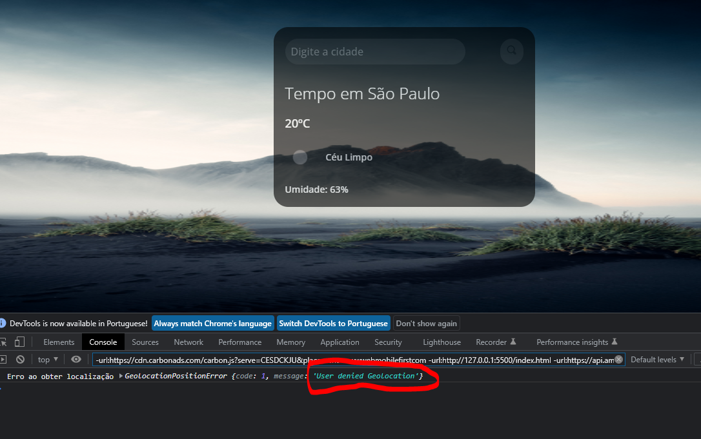
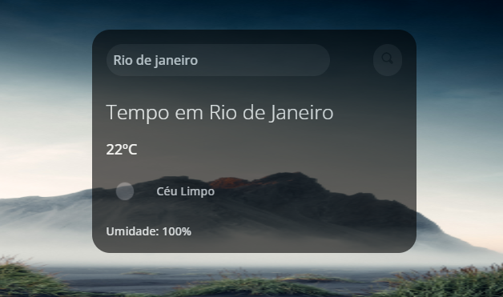
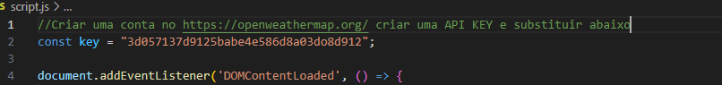

# Previsão do tempo

Acesse dados climáticos atualizados para qualquer localidade na Terra. Saiba as condições meteorológicas em tempo real, incluindo temperatura, umidade, descrição do tempo e muito mais. Com essa ferramenta, você pode obter informações precisas sobre o clima em qualquer cidade do mundo. Esteja você planejando uma viagem, precisando se vestir adequadamente ou simplesmente curioso sobre as condições climáticas em outras regiões, nossa plataforma oferece acesso fácil e rápido aos dados climáticos confiáveis. Fique por dentro das previsões meteorológicas e desfrute de uma experiência personalizada com informações climáticas em sua localização atual ou em qualquer lugar que desejar explorar.

### Funcionalidades

- Reconhecimento automatico da geolocalização do navegador.
- Caso o usuáro negue acesso a localização, é atribuido por default os dados do clima de São Paulo.
- Ou busca por qualquer outra região através do campo pesquisa.

### Screenshot

### Detalhes Tecnicos

- Para utilizar esse script é necessário criar uma conta no site https://openweathermap.org/ e criar uma API KEY e no arquivo script.js coloca-la em KEY

